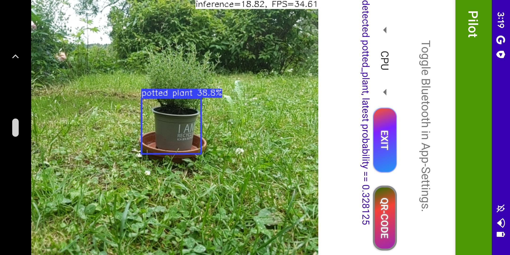
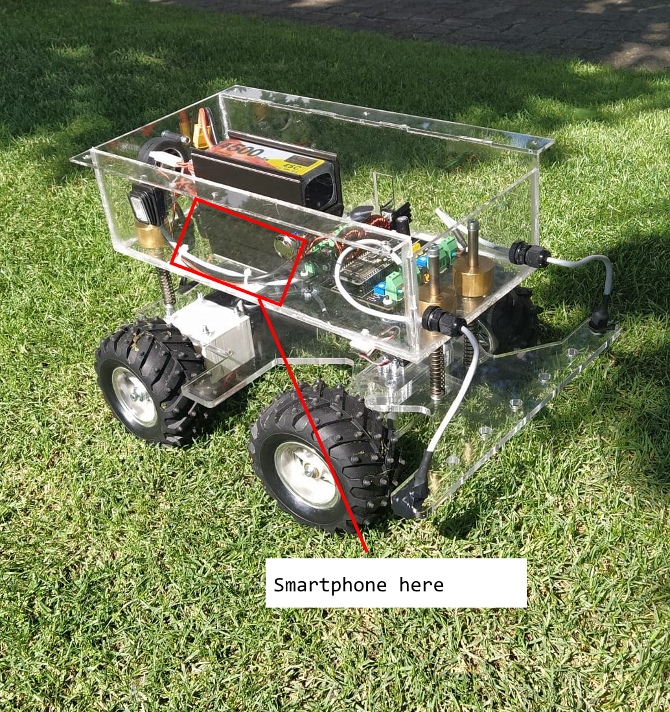
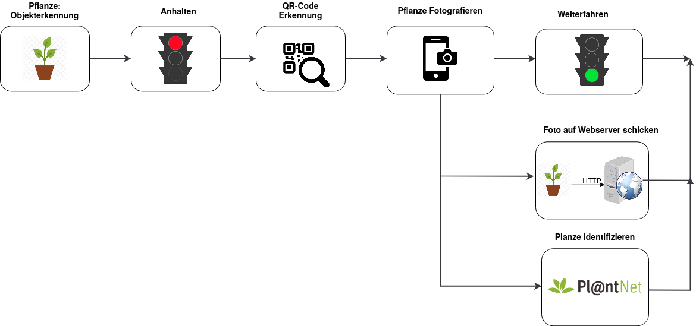

# ecstatic-pilot
## The brain behind an autonomous robot
## To test out the app, download and install the [apk](https://cyrill.icu/app-release.apk).

  

This is the software for a robot.  The robot is specifically built to get best scores at a tournament at HSLU.
It drives trough a parcour. A Smartphone is attached to it. The goal from a software perspective is to detect plants in real-time and communicate this the with hardware, so that the roboters stops. It then takes a image, which is uploaded to a webserver. The species of the plant will also be determined by calling an API. This is all happening completly autonomous without user input. 
The app will connect to a Bluetooth device in order to send commands to a microcontroller.
At the same time this is happening, status updates are sent to the webserver.

## Phone is mounted on Garteroboterli

  

# Finite State machine

  

## ACKNOWLEDGMENTS
This project wouldn't exist without the following open-source repositories.

-   [SimpleBluetoothTerminal](https://github.com/kai-morich/SimpleBluetoothTerminal) to enable communicating with a ESP32 microcontroller over Bluetooth.
-   [CameraXBasic](https://github.com/android/camera-samples/tree/main/CameraXBasic) Example project which uses the [CameraX](https://developer.android.com/training/camerax) library.
-   [ncnn-android-nanodet](https://github.com/nihui/ncnn-android-nanodet) NanoDet object detection, which depends on [ncnn](https://github.com/Tencent/ncnn). I modified the code to only check for certain objects.
-   [nv-websocket-client](https://github.com/TakahikoKawasaki/nv-websocket-client) ,which offers a High-quality WebSocket client implementation for Android in Java. 
-   [NanoDet](https://github.com/RangiLyu/nanodet) Super fast and lightweight anchor-free object detection model. Real-time on mobile devices.
