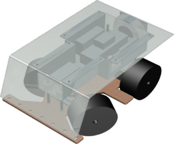

# ecstatic-pilot
## The brain behind an autonomous robot
We built a robot for a tournament.
It drives trough a parcour. 
The goal is to detect plants in real-time and read QR-Codes. The species of the plant will also be determined.

The app will connect to a Bluetooth device in order to send commands. 

At the same time this is happening, status updates are sent to the webserver.

  

### ACKNOWLEDGMENTS
This project wouldn't exist without the following open-source repositories.

-   [SimpleBluetoothTerminal](https://github.com/kai-morich/SimpleBluetoothTerminal) to enable communicating with a ESP32 microcontroller over Bluetooth.
-   [CameraXBasic](https://github.com/android/camera-samples/tree/main/CameraXBasic) Example project which uses the [CameraX](https://developer.android.com/training/camerax) library.
-   [ncnn-android-nanodet](https://github.com/nihui/ncnn-android-nanodet) NanoDet object detection, which depends on [ncnn](https://github.com/Tencent/ncnn). I modified the code to only check for certain objects.
-   [nv-websocket-client](https://github.com/TakahikoKawasaki/nv-websocket-client) ,which offers a High-quality WebSocket client implementation for Android in Java. 
-   [NanoDet](https://github.com/RangiLyu/nanodet) Super fast and lightweight anchor-free object detection model. Real-time on mobile devices.
